<div align="center">

<!-- HERO BANNER — replace with your actual GIF recording of the HTML page -->

<br/>
<br/>

<!-- TITLE BLOCK -->
<a href="https://roguekishore.github.io/Vantage">
  
</a>


<br/>
<br/>

<!-- TECH BADGES -->


<br/>
<br/>

<!-- STAT BADGES -->


<br/>
<br/>


**A gamified competitive programming platform — real-time battles, algorithm visualizers, LeetCode sync.**

[**→ Live Demo**](https://vantagecode.tech) · [**→ Setup Guide**](#-setup-guide) · [**→ Architecture**](#-architecture) · [**→ Features**](#-features)

<br/>

</div>

---

## ◈ Overview

**Vantage** transforms the grind of DSA practice into an immersive, gamified experience. Built for competitive programmers who want more than just solving problems — they want to **level up**, **compete**, and **conquer**.

<br/>

<table>
<tr>
<td width="50%">

**Why Vantage?**
- `⚔` **Gamified** — XP, coins, streaks, achievements, ELO ratings
- `◈` **Visual** — 150+ algorithm visualizers across 21 categories
- `🧭` **Roadmap** — 164-problem learning path across 27 stages
- `📡` **Live** — 1v1 ranked battles with real-time WebSocket sync
- `↻` **Auto-sync** — Chrome extension tracks your LeetCode progress
- `🏆` **Social** — Challenge friends, group battles, leaderboards

</td>
<td width="50%">

**Built With**
- **Frontend:** React 19 · Zustand · GSAP · Three.js · Monaco
- **Backend:** Spring Boot 4 · PostgreSQL · Redis · WebSocket
- **Judge:** Node.js · Docker sandboxed execution
- **Extension:** Chrome MV3 · Auto-sync + Bulk import
- **Styling:** Tailwind CSS · shadcn/ui

</td>
</tr>
</table>

---

## ✨ Features

<details open>
<summary><b>◈ Algorithm Visualizers</b></summary>
<br/>

<div align="center">
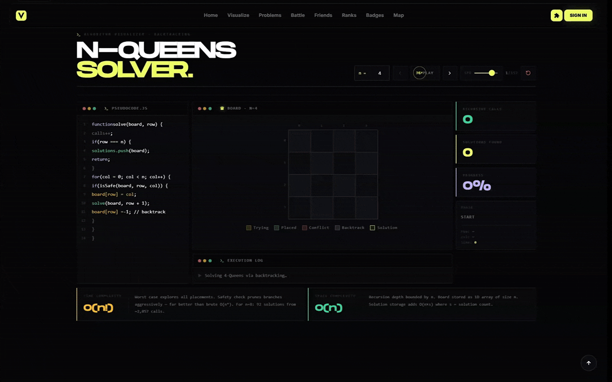
<br/><sub><b>N-Queens Backtracking — one of 150+ interactive visualizers</b></sub>
</div>

<br/>

150+ interactive visualizers across 21 algorithm categories. Watch Bubble Sort swap elements, see AVL trees balance, or trace Dijkstra in real-time.

| Category | Algorithms |
|:---|:---|
| **Sorting** | Bubble · Quick · Merge · Heap · Radix · Bucket · Shell · Insertion · Selection · Counting · Comb · Pancake |
| **Searching** | Linear · Binary · Jump · Interpolation · Exponential |
| **Trees** | BST Operations · AVL Rotations · Red-Black Trees · All Traversals |
| **Graphs** | BFS · DFS · Dijkstra · Bellman-Ford · Floyd-Warshall · Kruskal · Prim |
| **Dynamic Programming** | LCS · Knapsack · Matrix Chain · Coin Change · Edit Distance |
| **And More** | Backtracking · Recursion · Sliding Window · Two Pointers · Bit Manipulation |

**Key features:**
- 🎛 Adjustable speed controls — slow down or speed up animations
- ⏯ Step-by-step execution — pause and inspect each operation
- 🎨 Color-coded state — instantly understand element states
- 📊 Always-visible time/space complexity footer
- ✍ Integrated code editor for each algorithm

</details>

---

<details open>
<summary><b>⚔️ 1v1 Battle Arena</b></summary>
<br/>

<div align="center">

| Battle Lobby | Post-Match Analysis |
|:---:|:---:|
| 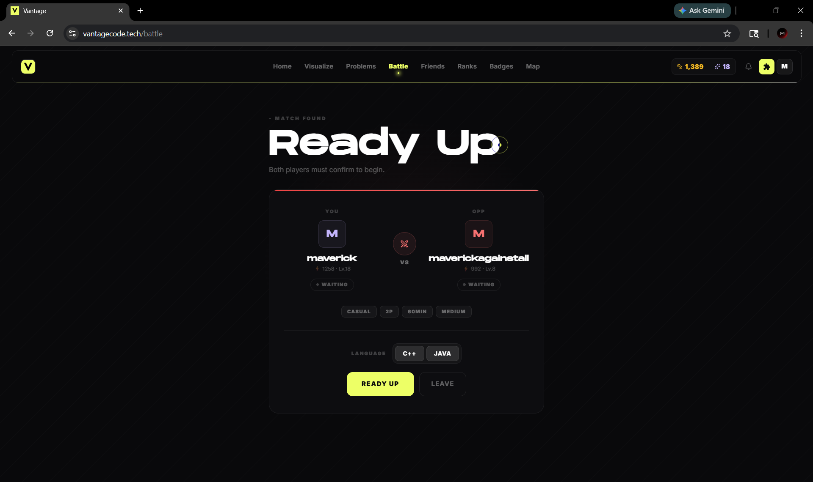 | 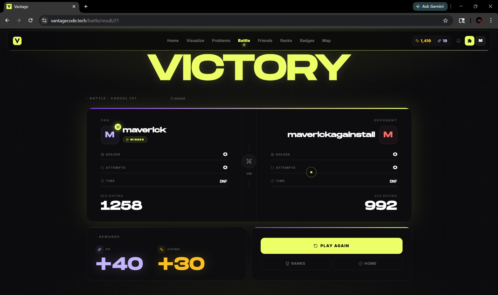 |

</div>

<br/>

Enter the arena and prove your skills. Challenge random opponents or friends in head-to-head coding battles with real-time sync.

| Mode | Description |
|:---|:---|
| ⚡ **Casual 1v1** | No rating changes — perfect for warming up |
| 👑 **Ranked 1v1** | ELO on the line. Climb the competitive ladder |

**Customization:** Difficulty (Easy/Medium/Hard) · Problems (1–3) · Duration (20min–3hr) · Language (C++/Java)

**Real-time features:** WebSocket live sync · Smart auto-submit timer · XP & Coin rewards · Dynamic ELO adjustments

</details>

---

<details open>
<summary><b>👥 Group Battles</b></summary>
<br/>

<div align="center">

| Group Lobby | Multi-Player Arena |
|:---:|:---:|
| 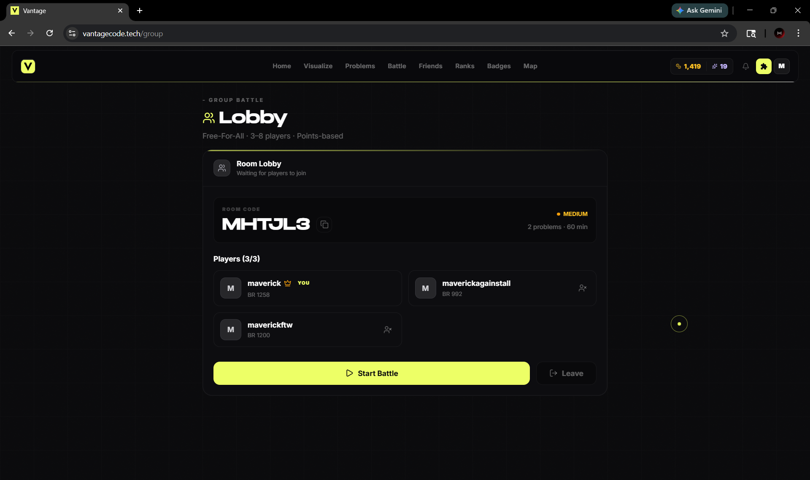 | 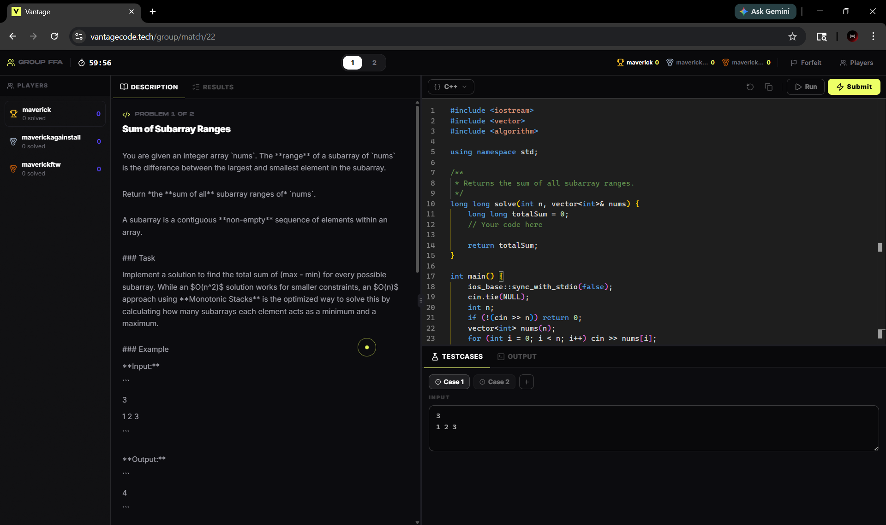 |

</div>

<br/>

```
CREATE ROOM  →  SHARE 6-CHAR CODE  →  BATTLE SIMULTANEOUSLY  →  LIVE LEADERBOARD
```

- 🔐 Private rooms with shareable 6-character codes
- 👑 Host controls — kick players, start/end battles
- 📊 Real-time standings that update live
- 🤝 Flexible size — 2 to 10 players per room

</details>

---

<details open>
<summary><b>🧪 Integrated Practice + Judge</b></summary>
<br/>

Write, run, and test solutions directly in the browser with a judge backed by Docker sandboxes.

- **Languages:** C++ and Java
- **Monaco-powered editor** with problem context and quick runs
- **Sandboxed execution** via a Node.js judge service and worker pool
- **Visualizer drawer** to jump from problem → visualizer instantly

</details>

---

<details open>
<summary><b>🔗 LeetCode Extension Sync</b></summary>
<br/>

<div align="center">
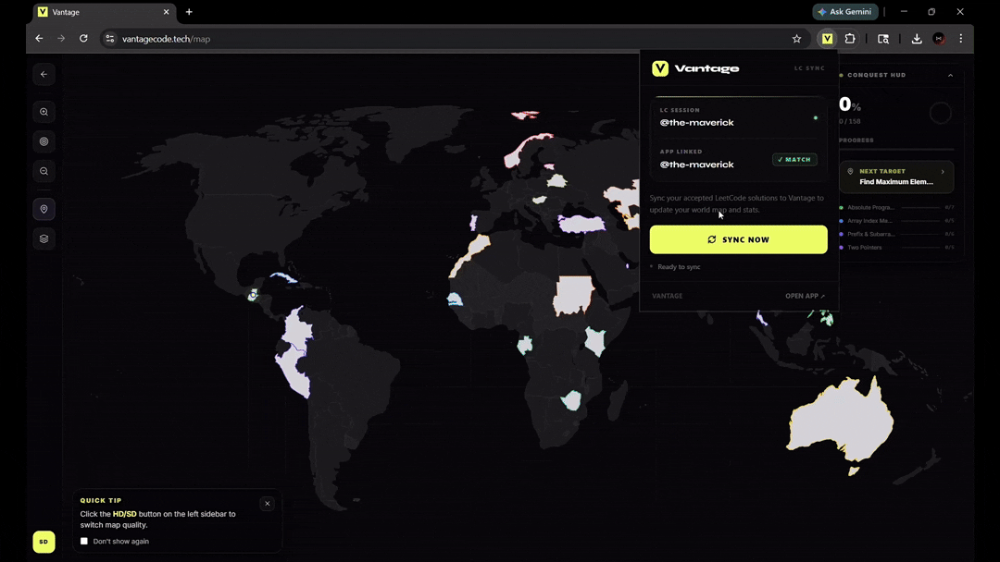
</div>

<br/>

Never manually track progress again. The Chrome extension silently intercepts accepted submissions and syncs them to Vantage instantly.

| Mode | Description |
|:---|:---|
| 🔄 **Auto-Sync** | Real-time detection of accepted submissions |
| 📦 **Bulk Sync** | One-click import of all previously solved problems |

```
LeetCode Tab
  injected.js (MAIN world)      →  Wraps fetch/XHR, detects AC
  content-script.js (ISOLATED)  →  Auth verification → sendMessage
                                           ↓
                                   background.js (Service Worker)
                                   POST /api/sync  →  Spring Boot (JWT Auth)
```

</details>

---

<details open>
<summary><b>🎮 Gamification System</b></summary>
<br/>

<div align="center">
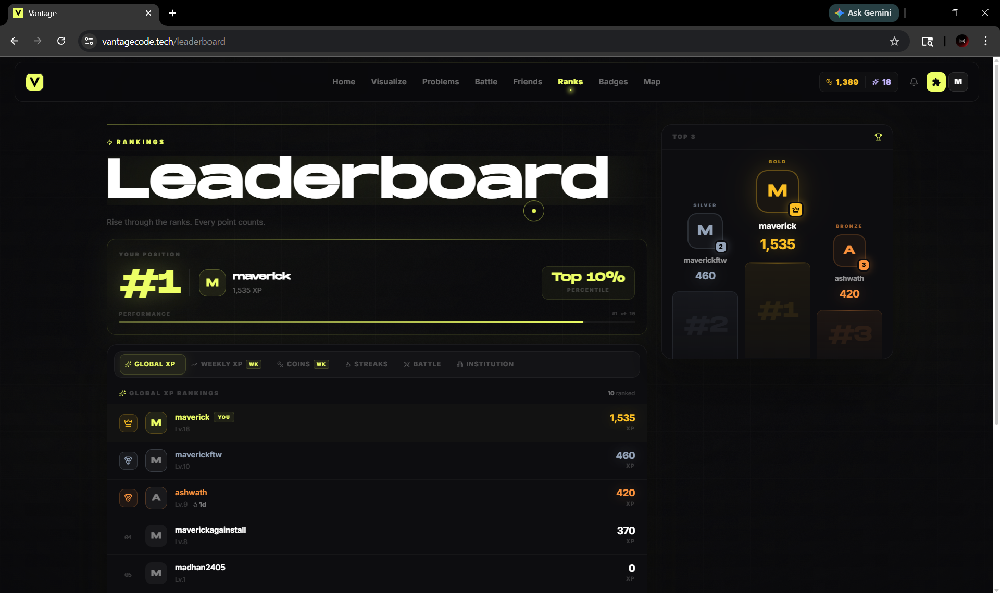
</div>

<br/>

```
DIFFICULTY   COINS    XP       1ST ATTEMPT
─────────────────────────────────────────
BASIC        +3       +5 XP    +20% bonus
EASY         +5       +10 XP   +20% bonus
MEDIUM       +15      +25 XP   +20% bonus
HARD         +30      +50 XP   +20% bonus
```

**🔥 Streak Multipliers**

| Days | Multiplier | Bonus |
|:---|:---|:---|
| 1–7 | 1.0×–1.3× | Base rewards building |
| 7–14 | 1.4×–1.7× | Streak shield unlock |
| 14–30 | 1.8×–2.5× | Milestone coin bonuses |
| 30+ | 2.5×+ | Legendary status |

**🏆 Achievements:** Problem milestones · Battle victories · Category mastery · Streak legends · Special event badges

</details>

---

<details open>
<summary><b>🤝 Friends, Challenges & Notifications</b></summary>
<br/>

Build your squad and keep up with competitive progress.

- **Friend requests & profiles** with live updates
- **Direct challenges** and private battle invites
- **Notification badges** for incoming requests
- **Do-not-disturb** mode to mute challenge spam

</details>

---

<details open>
<summary><b>🗺️ DSA Conquest Map</b></summary>
<br/>

<div align="center">
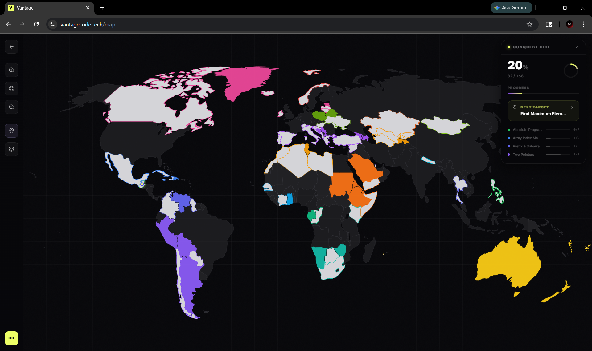
</div>

<br/>

An interactive world map where each country is a problem. Conquer territories as you solve algorithms — guided by a roadmap, locked behind prerequisites.

- **164 total problems** mapped across **27 stages** (24 main + 3 bonus)
- **Pattern-first learning** (two pointers, sliding window, DP, graphs, and more)
- **LeetCode-linked** problems with visualizer routes when available

```
FUNDAMENTALS  →  CORE  →  STANDARD  →  ADVANCED  →  EXPERT  →  MASTERY
```

</details>

---

<details open>
<summary><b>📚 Problem Catalog & Progress Tracking</b></summary>
<br/>

Everything is mapped and searchable, with links to both the visualizer and the original LeetCode problem when available.

- **Stage-aware routing** (problem → category → visualizer)
- **Search by topic** (arrays, graphs, DP, hashing, and more)
- **Progress status** (not started / in progress / completed)

</details>

---

## 📸 Screenshots

<div align="center">

| Home | Register | Sign In |
|:---:|:---:|:---:|
| 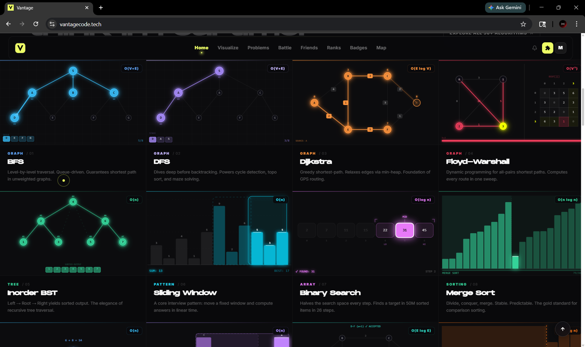 | 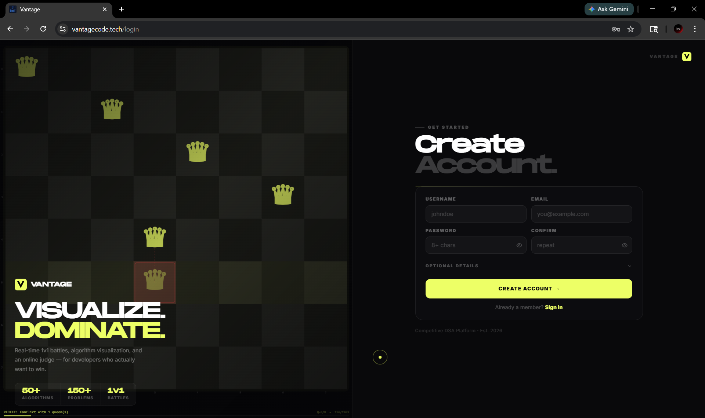 | 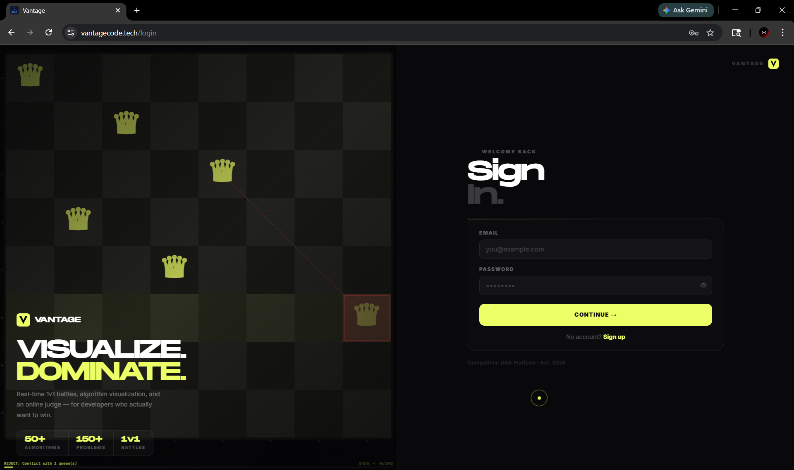 |
| **Problems** | **Battle** | **Leaderboard** |
| 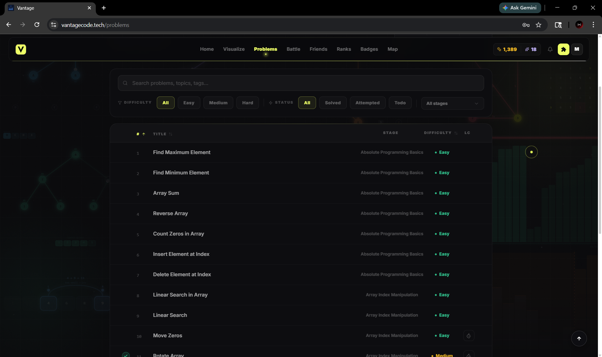 | 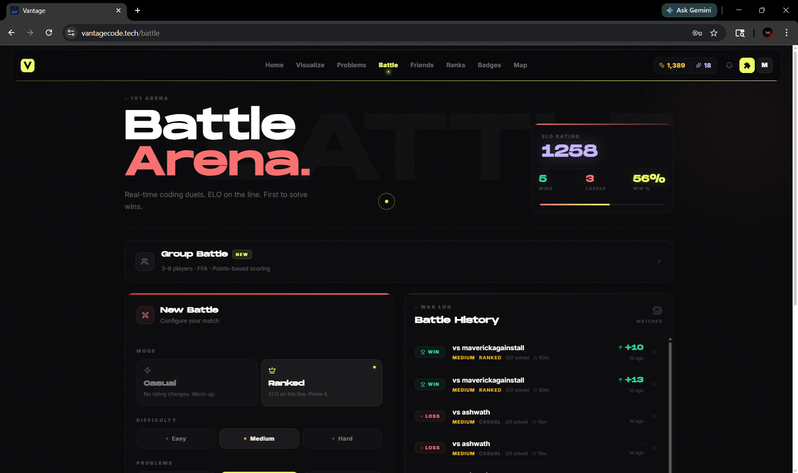 |  |

</div>

---

## 🏗 Architecture

```
┌──────────────────────────────────────────────────────────────────────┐
│                            VANTAGE                                   │
├──────────────────────────────────────────────────────────────────────┤
│                                                                      │
│  ┌─────────────┐   ┌─────────────┐   ┌─────────────┐  ┌──────────┐  │
│  │    REACT    │   │   SPRING    │   │    JUDGE    │  │ CHROME   │  │
│  │  FRONTEND   │◄─►│   BACKEND   │◄─►│   SERVICE   │  │   EXT    │  │
│  │             │   │             │   │             │  │          │  │
│  │ Zustand     │   │ REST API    │   │ Docker      │  │ MV3      │  │
│  │ Three.js    │   │ WebSocket   │   │ C++ / Java  │  │ Auto-sync│  │
│  │ GSAP        │   │ PostgreSQL  │   │ Worker Pool │  │ Bulk sync│  │
│  │ Monaco      │   │ Redis       │   │ Sandbox     │  │          │  │
│  └─────────────┘   └─────────────┘   └─────────────┘  └──────────┘  │
│         └──────────────────┴──────────────────┘                     │
│                             │                                        │
│              ┌──────────────▼──────────────┐                         │
│              │       DOCKER COMPOSE        │                         │
│              │    Production Deployment    │                         │
│              └─────────────────────────────┘                         │
└──────────────────────────────────────────────────────────────────────┘
```

| Service | Port | Description |
|:---|:---:|:---|
| **React App** | `3000` | Frontend SPA — visualizers, battle UI, conquest map |
| **Spring Boot** | `8080` | REST API, auth, gamification engine, battle orchestration |
| **Judge Service** | `4000` | Code execution with Docker sandboxes |
| **PostgreSQL** | `5432` | Primary database |
| **Redis** | `6379` | Session caching and real-time state |

---

## 🚀 Setup Guide

<details>
<summary><b>📦 Frontend — React</b></summary>

```bash
cd reactapp
npm install
cp .env.example .env

# Configure .env
REACT_APP_API_URL=http://localhost:8080
REACT_APP_JUDGE_URL=http://localhost:4000

npm start
# → http://localhost:3000
```

</details>

<details>
<summary><b>🔧 Backend — Spring Boot</b></summary>

```bash
cd springapp
./mvnw clean install -DskipTests

# Configure application.properties
# → DB connection, JWT secret, Firebase credentials

./mvnw spring-boot:run
# → http://localhost:8080
```

</details>

<details>
<summary><b>⚙️ Judge Service</b></summary>

```bash
cd judge
npm install

# Local dev (no Docker)
MODE=host npm start

# Production (sandboxed)
docker-compose up -d
# Workers: cpp-worker ×3 · java-worker ×3
```

</details>

<details>
<summary><b>🔌 Chrome Extension</b></summary>

```bash
# 1. Open chrome://extensions/
# 2. Enable "Developer mode"
# 3. Click "Load unpacked" → select extension/ folder
```

</details>

<details>
<summary><b>🐳 Full Docker Deploy</b></summary>

```bash
docker-compose -f docker-compose.yml up -d

# Starts: PostgreSQL · Redis · Spring Boot · Judge + workers · React (prod build)
```

</details>

---

## 📁 Project Structure

```
Vantage/
├── reactapp/                    # React frontend
│   └── src/
│       ├── components/          # Reusable UI components
│       │   ├── visualizer/      # Visualizer engine
│       │   └── animations/      # Canvas animations
│       ├── pages/
│       │   ├── algorithms/      # 21 algorithm categories
│       │   ├── battle/          # 1v1 battle pages
│       │   └── group/           # Group battle pages
│       └── stores/              # Zustand state
│
├── springapp/                   # Spring Boot backend
│   └── src/main/java/com/backend/
│       ├── controller/          # REST endpoints
│       ├── service/             # Business logic
│       └── model/               # Entities
│
├── judge/                       # Code execution service
│   ├── executor.js              # Execution engine
│   ├── workerPool.js            # Docker pool manager
│   └── sandboxes/               # cpp/ · java/
│
└── extension/                   # Chrome extension
    ├── manifest.json            # MV3 manifest
    ├── background.js            # Service worker
    ├── content-script.js        # DOM interaction
    └── injected.js              # Network interception
```

---

## 🤝 Contributing

```bash
git checkout -b feature/amazing-feature
git commit -m 'Add amazing feature'
git push origin feature/amazing-feature
# → Open a Pull Request
```

---

<div align="center">


<br/>


<br/>

⭐ **Star this repo if you find it useful**

</div>