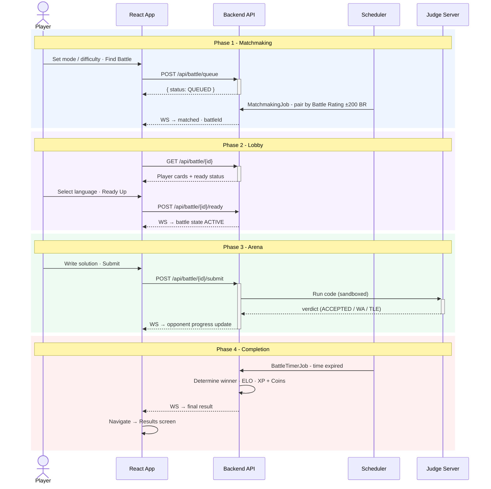

# Battle Arena - Sequence Diagram

```mermaid
sequenceDiagram
    actor Player
    participant App as React App
    participant API as Backend API
    participant Sched as Scheduler
    participant Judge as Judge Server

    rect rgba(59, 130, 246, 0.08)
        Note over Player,Judge: Phase 1 - Matchmaking
        Player->>App: Set mode / difficulty · Find Battle
        App->>+API: POST /api/battle/queue
        API-->>-App: { status: QUEUED }
        Sched->>API: MatchmakingJob - pair by Battle Rating ±200 BR
        API-->>App: WS → matched · battleId
    end

    rect rgba(168, 85, 247, 0.08)
        Note over Player,Judge: Phase 2 - Lobby
        App->>+API: GET /api/battle/{id}
        API-->>-App: Player cards + ready status
        Player->>App: Select language · Ready Up
        App->>API: POST /api/battle/{id}/ready
        API-->>App: WS → battle state ACTIVE
    end

    rect rgba(34, 197, 94, 0.08)
        Note over Player,Judge: Phase 3 - Arena
        Player->>App: Write solution · Submit
        App->>+API: POST /api/battle/{id}/submit
        API->>+Judge: Run code (sandboxed)
        Judge-->>-API: verdict (ACCEPTED / WA / TLE)
        API-->>-App: WS → opponent progress update
    end

    rect rgba(239, 68, 68, 0.08)
        Note over Player,Judge: Phase 4 - Completion
        Sched->>API: BattleTimerJob - time expired
        API->>API: Determine winner · ELO · XP + Coins
        API-->>App: WS → final result
        App->>App: Navigate → Results screen
    end
```
