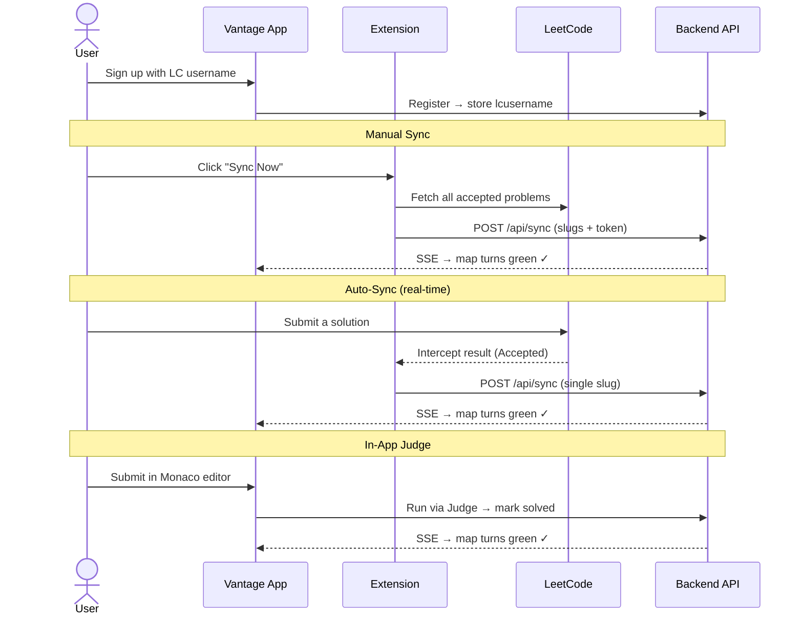

# LeetCode Sync - Sequence Diagram

```mermaid
sequenceDiagram
    actor User
    participant App as Vantage App
    participant Ext as Extension
    participant LC as LeetCode
    participant API as Backend API

    User->>App: Sign up with LC username
    App->>API: Register → store lcusername

    Note over User,API: Manual Sync
    User->>Ext: Click "Sync Now"
    Ext->>LC: Fetch all accepted problems
    Ext->>API: POST /api/sync (slugs + token)
    API-->>App: SSE → map turns green ✓

    Note over User,API: Auto-Sync (real-time)
    User->>LC: Submit a solution
    LC-->>Ext: Intercept result (Accepted)
    Ext->>API: POST /api/sync (single slug)
    API-->>App: SSE → map turns green ✓

    Note over User,API: In-App Judge
    User->>App: Submit in Monaco editor
    App->>API: Run via Judge → mark solved
    API-->>App: SSE → map turns green ✓
```
